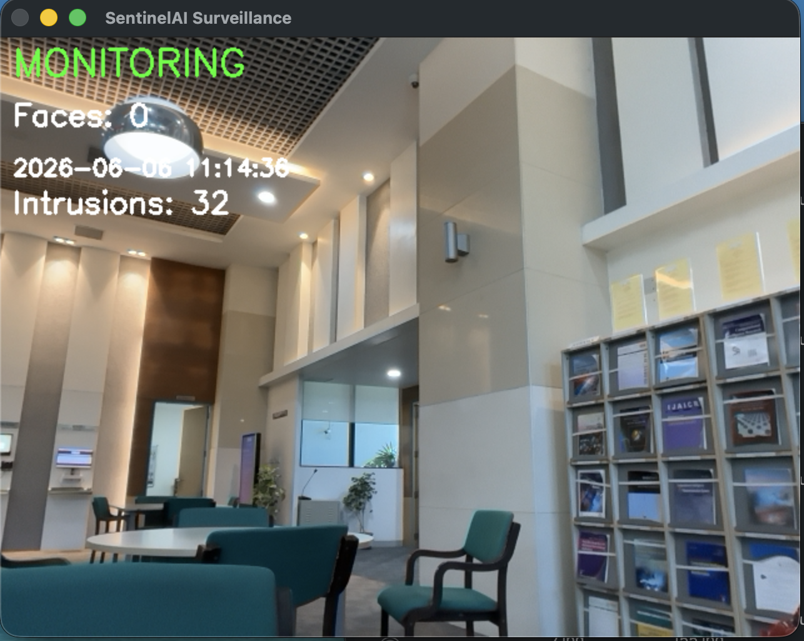
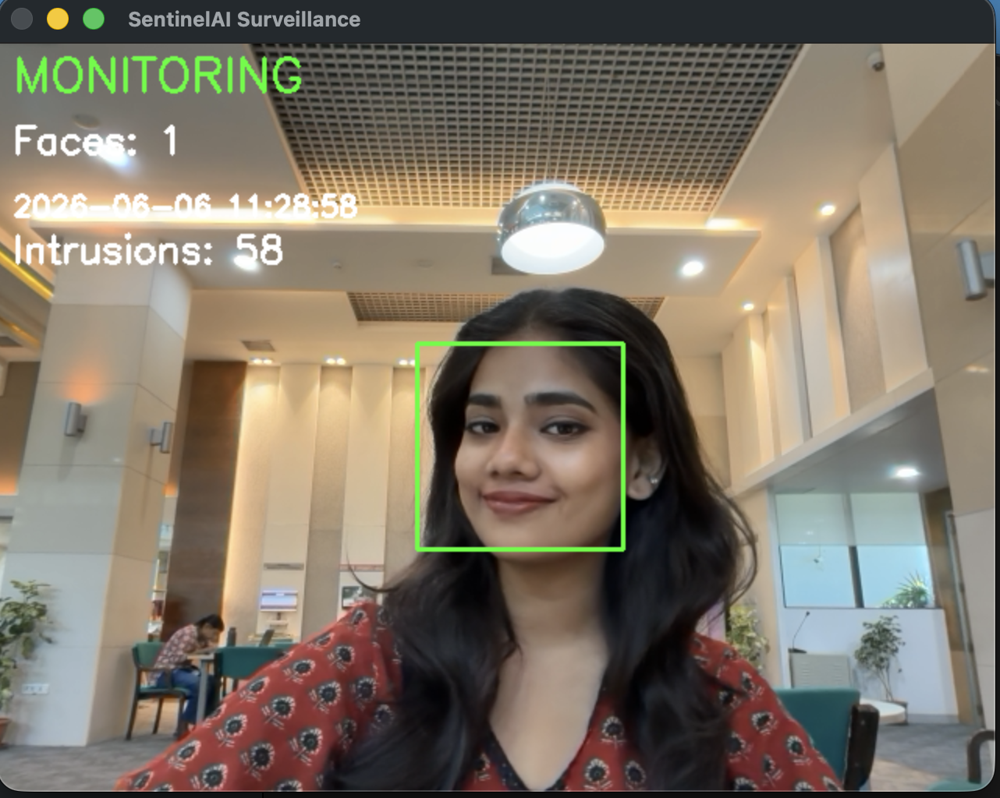

# SentinelAI 🚨

AI-powered smart surveillance system built using Python and OpenCV.

## Features

* Motion Detection
* Face Detection
* Intrusion Detection
* Snapshot Capture
* Email Alert System
* Event Logging
* Intrusion Counter
* Smart 15-Second Recording
* Separate Video Recording Per Intrusion
* Real-Time Monitoring

## Technologies Used

* Python
* OpenCV
* Haar Cascade Face Detection
* SMTP Email Alerts

## Project Structure

```text
EdgeAI/
│
├── intruder.py
├── recordings/
├── snapshots/
├── screenshots/
├── logs/
└── README.md
```

## Workflow

1. Detect Motion
2. Detect Face
3. Capture Snapshot
4. Send Email Alert
5. Start Recording
6. Save Intrusion Video
7. Store Event Logs

## Screenshots

### Monitoring Mode



### Recording Mode



## Future Improvements

* Face Recognition
* YOLO Object Detection
* Raspberry Pi Deployment
* Edge AI Optimization
* Telegram Alerts
* Mobile Notifications

## Author

Devi Krishna Manoj

B.Tech Electronics and Communication Engineering

Edge AI Enthusiast

